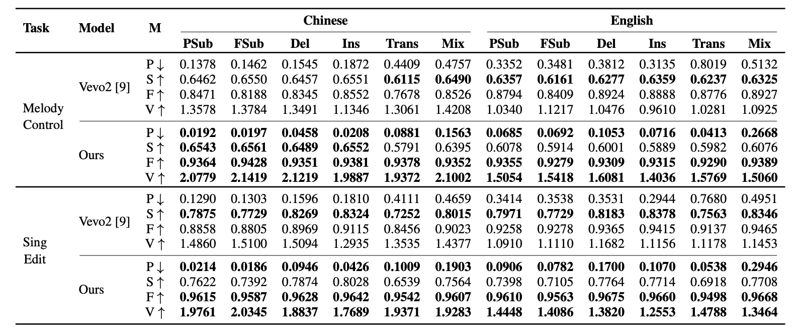

<div align="center">

<h1>🎤 YingMusic-Singer: Controllable Singing Voice Synthesis with Flexible Lyric Manipulation and Annotation-free Melody Guidance</h1>

<p>
  <a href="">English</a> ｜ <a href="README_ZH.md">中文</a>
</p>


[](https://arxiv.org/abs/2603.24589)
[](https://github.com/ASLP-lab/YingMusic-Singer)
[](https://aslp-lab.github.io/YingMusic-Singer-Demo/)
[](https://huggingface.co/spaces/ASLP-lab/YingMusic-Singer)
[](https://huggingface.co/ASLP-lab/YingMusic-Singer)
[](https://huggingface.co/datasets/ASLP-lab/LyricEditBench)
[](https://discord.gg/RXghgWyvrn)
[](https://github.com/ASLP-lab/YingMusic-Singer/blob/main/assets/wechat_qr.png)
[](http://www.npu-aslp.org/)

<p>
        <a href="https://orcid.org/0009-0005-5957-8936">Chunbo Hao</a><sup>1,2</sup> ·
        <a href="https://orcid.org/0009-0003-2602-2910">Junjie Zheng</a><sup>2</sup> ·
        <a href="https://orcid.org/0009-0001-6706-0572">Guobin Ma</a><sup>1</sup> ·
        Yuepeng Jiang<sup>1</sup> ·
        Huakang Chen<sup>1</sup> ·
        Wenjie Tian<sup>1</sup> ·
        <a href="https://orcid.org/0009-0003-9258-4006">Gongyu Chen</a><sup>2</sup> ·
        <a href="https://orcid.org/0009-0005-5413-6725">Zihao Chen</a><sup>2</sup> ·
        Lei Xie<sup>1</sup>
</p>

<p>
        <sup>1</sup> Audio, Speech and Language Processing Group (ASLP@NPU), School of Computer Science, Northwestern Polytechnical University, China<br>
        <sup>2</sup> AI Lab, GiantNetwork, China
</p>

</div>

<div align="center">

<p><i>Overall architecture of YingMusic-Singer. Left: SFT training pipeline. Right: GRPO training pipeline.</i></p>
</div>


## 📖 Introduction

**YingMusic-Singer** is a fully diffusion-based singing voice synthesis model that enables **melody-controllable singing voice editing with flexible lyric manipulation**, requiring no manual alignment or precise phoneme annotation.

Given only three inputs — an optional timbre reference, a melody-providing singing clip, and modified lyrics — YingMusic-Singer synthesizes high-fidelity singing voices at **44.1 kHz** while faithfully preserving the original melody.


## ✨ Key Features

- **Annotation-free**: No manual lyric-MIDI alignment required at inference
- **Flexible lyric manipulation**: Supports 6 editing types — partial/full changes, insertion, deletion, translation (CN↔EN), and code-switching
- **Strong melody preservation**: CKA-based melody alignment loss + GRPO-based optimization
- **Bilingual**: Unified IPA tokenizer for both Chinese and English
- **High fidelity**: 44.1 kHz stereo output via Stable Audio 2 VAE


## 🚀 Quick Start

### Option 1: Install from Scratch

```bash
# We strongly recommend uv for faster dependency resolution.
uv venv --python 3.10
source .venv/bin/activate  # On Windows: .venv\Scripts\activate
uv pip install -r requirements.txt

# If you are in CN, use the USTC mirror for faster downloads:
uv pip install -r requirements.txt -i https://mirrors.ustc.edu.cn/pypi/simple

# Alternatively, conda is also supported:
conda create -n YingMusic-Singer python=3.10
conda activate YingMusic-Singer
pip install uv
uv pip install -r requirements.txt

# If you are in CN:
uv pip install -r requirements.txt -i https://mirrors.ustc.edu.cn/pypi/simple
```
### Option 2: Pre-built Environment

**Conda**

1. Download and install **Miniconda** from https://repo.anaconda.com/miniconda/ for your platform. Verify with `conda --version`.
2. Download the pre-built environment package for your setup from the table below.
3. Navigate to your Conda `envs/` directory and create a folder named `YingMusic-Singer`.
4. Move the downloaded package into that folder and extract it:
```bash
   tar -xvf <package_name>
```

**uv**

1. Install **uv** via `pip install uv` or follow the [official instructions](https://docs.astral.sh/uv/getting-started/installation/).
2. Download the pre-built environment package for your setup from the table below.
3. Extract the package and activate the environment:
```bash
   tar -xvf <package_name>
   source .venv/bin/activate  # On Windows: .venv\Scripts\activate
```

| CPU Architecture | GPU    | OS      | Type  | Download     |
|------------------|--------|---------|-------|--------------|
| AMD64            | NVIDIA | Linux   | Conda | Coming soon  |
| AMD64            | NVIDIA | Linux   | uv    | Coming soon  |
| AMD64            | NVIDIA | Windows | uv    | Coming soon  |

### Option 3: Docker

Build the image:

```bash
docker build -t yingmusic-singer .
```

## 🎵 Inference

### Option 1: Online Demo (HuggingFace Space)

Visit https://huggingface.co/spaces/ASLP-lab/YingMusic-Singer to try the model instantly in your browser.

### Option 2: Local Gradio App (same as online demo)

```bash
python app_local.py
```

### Option 3: Command-line Inference

```bash
python infer.py \
    --ref_audio examples/hf_space/melody_control/melody_control_ZH_02_timbre.wav \
    --melody_audio examples/hf_space/melody_control/melody_control_ZH_02_melody.wav \
    --ref_text "就让你|在别人怀里|快乐" \
    --target_text "Missing you in my mind|missing you in my heart" \
    --output output/melody_control_zh_missing_you.wav
```

Enable vocal separation and accompaniment mixing:

```bash
python infer.py \
    --ref_audio examples/hf_space/lyric_edit/SingEdit_EN_01.wav \
    --melody_audio examples/hf_space/lyric_edit/SingEdit_EN_01.wav \
    --ref_text "can you tell my heart is speaking|my eyes will give you clues" \
    --target_text "can you spot the moon is grinning|my lips will show you hints" \
    --separate_vocals \
    --mix_accompaniment \
    --output output/lyric_edit_en_moon_grinning.wav
```
### Option 4: Batch Inference

> **Note**: All audio fed to the model must be pure vocal tracks (no accompaniment). If your inputs contain accompaniment, run vocal separation first using `src/third_party/MusicSourceSeparationTraining/inference_api.py`.

The input JSONL file should contain one JSON object per line, formatted as follows:

```json
{
    "id": "lyric_edit_en_moon_grinning", 
    "melody_ref_path": "examples/hf_space/lyric_edit/SingEdit_EN_01.wav", 
    "gen_text": "can you spot the moon is grinning|my lips will show you hints", 
    "timbre_ref_path": "examples/hf_space/lyric_edit/SingEdit_EN_01.wav", 
    "timbre_ref_text": "can you tell my heart is speaking|my eyes will give you clues"
}
```

```bash
python batch_infer.py \
    --input_type jsonl \
    --input_path /path/to/input.jsonl \
    --output_dir /path/to/output \
    --ckpt_path /path/to/ckpts \
    --num_gpus 4
```

Multi-process inference on **LyricEditBench (melody control)** — the test set will be downloaded automatically:

```bash
python inference_mp.py \
    --input_type lyric_edit_bench_melody_control \
    --output_dir path/to/LyricEditBench_melody_control \
    --ckpt_path ASLP-lab/YingMusic-Singer \
    --num_gpus 8
```

Multi-process inference on **LyricEditBench (singing edit)**:

```bash
python inference_mp.py \
    --input_type lyric_edit_bench_sing_edit \
    --output_dir path/to/LyricEditBench_sing_edit \
    --ckpt_path ASLP-lab/YingMusic-Singer \
    --num_gpus 8
```

## 🏗️ Model Architecture

YingMusic-Singer consists of four core components:

| Component | Description |
|-----------|-------------|
| **VAE** | Stable Audio 2 encoder/decoder; downsamples stereo 44.1 kHz audio by 2048× |
| **Melody Extractor** | Encoder of a pretrained MIDI extraction model (SOME); captures disentangled melody information |
| **IPA Tokenizer** | Converts Chinese & English lyrics into a unified phoneme sequence with sentence-level alignment |
| **DiT-based CFM** | Conditional flow matching backbone following F5-TTS (22 layers, 16 heads, hidden dim 1024) |

**Total parameters**: ~727.3M (453.6M CFM + 156.1M VAE + 117.6M Melody Extractor)


## 📊 LyricEditBench

We introduce **LyricEditBench**, the first benchmark for melody-preserving lyric modification evaluation, built on [GTSinger](https://github.com/GTSinger/GTSinger). The dataset is available on HuggingFace at https://huggingface.co/datasets/ASLP-lab/LyricEditBench.

### Results

<div align="center">
<p><i>Table 2: Comparison with Baseline Model on LyricEditBench across Task Types in Table 1 and Languages. Metrics (M): P: PER, S:
SIM, F: F0-CORR, V: VS are detailed in Section 3. Best results are Bold.</p>

</div>


## 🙏 Acknowledgements

This work builds upon the following open-source projects:

- [F5-TTS](https://github.com/SWivid/F5-TTS) — DiT-based CFM backbone
- [Stable Audio 2](https://github.com/Stability-AI/stable-audio-tools) — VAE architecture
- [SOME](https://github.com/openvpi/SOME) — Melody Extractor
- [DiffRhythm](https://github.com/ASLP-lab/DiffRhythm) — Sentence-level alignment strategy
- [GTSinger](https://github.com/GTSinger/GTSinger) — Benchmark base corpus
- [Emilia](https://huggingface.co/datasets/amphion/Emilia-Dataset) — TTS pretraining data


## 📄 License

The code and model weights in this project are licensed under [CC BY 4.0](https://creativecommons.org/licenses/by/4.0/), **except** for the following:

The VAE model weights and inference code (in `src/YingMusic-Singer/utils/stable-audio-tools`) are derived from [Stable Audio Open](https://huggingface.co/stabilityai/stable-audio-open-1.0) by Stability AI, and are licensed under the [Stability AI Community License](./LICENSE-STABILITY).


<p align="center">
  
</p>